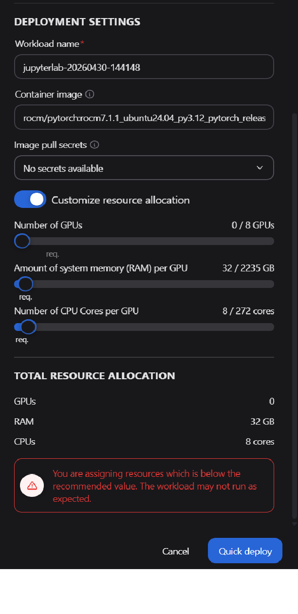

# 3. AMD Workbench

AMD AI Workbench is the end-user interface for deploying and interacting with AI models. 

1. Navigate to the AIWB URL.

2. Log in with the EAI Suite credentials. Ensure you are working within the project you created in the previous section.

<!-- SCREENSHOT: AMD AI Workbench landing page after login, showing the main navigation -->

------------------------------------------------------------------------

## Deploy an AI Model (AIM)

> **Note:** You are in the **AMD AI Workbench** interface for this section. Ensure you have selected the correct project before proceeding.


1. Navigate to the **Models** tab to access the AIM catalog
2. Select **GPT OSS 20B** model and click the **three-dot menu (⋮)** in the bottom-right corner of the model card
3. Select **Deploy**


4. Configure the **Deployment Settings**:

   - **Performance metric** — Select the optimization target from the dropdown:

     | Option | When to use |
     |--------|-------------|
     | **Latency** | When minimizing response time per request is the priority |
     | **Throughput** | When maximizing sustained requests/second is the priority |

   - **Unoptimized deployment** — Toggle **Allow** only when deploying to hardware the AIM is not specifically optimized for. Leave this off for standard deployments.

   <!-- TODO: Specify which performance metric to select for this HOL exercise -->

<!-- SCREENSHOT: Deployment config panel showing Performance metric dropdown open with Latency and Throughput options -->


6. Click **Deploy**. A confirmation message will appear indicating the workload has started.

<!-- SCREENSHOT: Deployment confirmation notification or toast message -->

7. **Wait for the model to become ready.** Navigate to **Workloads** to monitor deployment status. The model is ready when its status shows **Running**.

   > Deployment typically takes <!-- TODO: fill in approximate time, e.g., "3–5 minutes" --> depending on model size and cluster load.

<!-- SCREENSHOT: Workloads list view showing the deployed model with "Running" status -->

------------------------------------------------------------------------

## Monitor the deployment
While the model downloads and initializes, you can monitor its deployment status:

1. Navigate to either the Deployed Models tab (on the Models page) or the Dasboard page

2. Observe the status of your new workload

3. Wait for the status to transition from Pending to Running


## Interact with the model
Once your model is successfully deployed, you can interact with it in two primary ways:

* Chat Interface: Use the built-in Chat page within the AI Workbench for direct interactive testing

* API Integration: Programmatically access the model using the AIM’s OpenAI‑compatible API endpoint

## Interact with the model via the chat interface

Once your model is successfully deployed, you can interact with it through the chat Interface. The Chat page is ideal for exploratory testing, prompt engineering, and receiving immediate feedback from your deployed models.

To interact with your model, follow these steps:

1. Navigate to the Deployed Models tab, pick your model and click Chat with model, or open the Chat page directly from the main navigation menu and then select your model

2. Enter your prompt in the chat box and submit it to the model

3. Experiment with the model’s output by adjusting generation parameters (see Figure 5 below). Access these controls, such as temperature, by clicking the settings toggle in the upper-right corner.

4. Review the response in the chat window and refine your prompt or parameters as needed to achieve the desired result

For example, you can submit a simple prompt like, “Can you create an itinerary for my visit to Paris during 7 days” and then observe how modifying the generation parameters affects the detail and style of the answer.

Output:

## Interact with the model via Jupyter Lab workspace
From the Workspace page, you can launch pre-configured development workspaces to accelerate experimentation. For example, JupyterLab and VS Code workspaces enable users to harness the power of the cluster with zero configuration on their local machines.

### Deploy your Jupyter Lab workspace
Navigate to the Workspaces page, where you will find a catalog of available workspaces:

1. Locate the Jupyter Lab card and click View and deploy. This will open the deployment configuration view where you can customize your workspace before deployment (See Figure 7).

2. Configure the following settings:

    * Workload name: Give your workspace a unique name

    * Container image: Keep the default image. The workspace will automatically pull and run the image upon deployment.

    * Customize resource allocation: Allocate hardware resources using the provided sliders. The following configuration was used to validate this blog:

      * GPU: 0

      * CPU: 8 cores

      * RAM: 32 GB

3. Once you have finalized the configuration, launch the environment by clicking Quick deploy

## Finetuning


Finetuning allows you to adapt a base model to domain-specific data.

### Typical Workflow

1. **Add Hugging Face token** — Required for accessing gated models and datasets


2. **Navigate to Datasets and upload training data** — In **AI Workbench**, open **Datasets** from the left navigation and click **Upload**.

For this lab, please use dataset here: https://github.com/isab8liu-alum/eai-suite-guides/blob/main/dataset/argilla-1.jsonl


3. **Create the dataset entry** — Enter a dataset name, choose the correct data type, optionally add a description, then upload your `.jsonl` file and click **Upload**.
4. **Go to Custom Models** — Open **Models** and switch to the **Custom Models** tab.


5. **Start fine-tuning** — Click **Fine-tune model**, select the base model and uploaded dataset, configure training parameters, then click **Start training**.


<!-- SCREENSHOT: Finetuning section of the UI (once steps are documented) -->

------------------------------------------------------------------------


## VSCode Workspace (vLLM Benchmarking)

This section demonstrates how to use the built-in Visual Studio Code workspace to benchmark a deployed model using the `vllm bench` tool.
Prereq: minio credentials must be added to project secrets.

### Launch the VSCode Workspace

1. Navigate to **Workspaces** in the left sidebar
2. Click **View and deploy** next to the Visual Studio Code workspace entry. Click the **Customize Resource Allocation** and set the allocated GPUs=0, because we won't need GPUs for the workspace deployment.



3. Once deployed, click the **Launch** button to open VSCode in your browser

<!-- SCREENSHOT: Workspaces page — showing the "View and deploy" and "Launch" buttons -->

<!-- SCREENSHOT: VSCode workspace open in the browser -->

### Get the Model Endpoint

Before running the benchmark, retrieve the internal endpoint of your deployed model:

1. Navigate to the **Models** tab
2. On the deployed model card, click the **three-dot menu (⋮)** and select **Connect**
3. Copy the **Internal URL** — this is the endpoint used within the cluster

   > If accessing from outside the cluster (e.g., from your local machine), use the **External URL** together with an API key instead.

<!-- SCREENSHOT: Connect dialog showing Internal URL and External URL fields -->

### Run the Benchmark

Create a new bash script file to configure and run the benchmark, and save as "bench_serve.sh". Replace the placeholder values with those for your deployment:


```bash
NUM_PROMPTS= 20 #<number-of-prompts>
CONC=$((NUM_PROMPTS * 10))   # Sets concurrency to 10x the prompt count — adjust as needed
INPUT_LEN=1024 #<input-token-length> #
OUTPUT_LEN=1024 #<output-token-length>
BASE_URL="<your-internal-url>"
ENDPOINT="/v1/chat/completions"
MODEL="openai/gpt-oss-12b" #USE A NON GATED MODEL TO AVOID Hugging face TOKEN ISSUES

vllm bench serve \
  --ignore-eos \
  --backend openai-chat \
  --base-url "${BASE_URL}" \
  --endpoint "${ENDPOINT}" \
  --model "${MODEL}" \
  --dataset-name random \
  --random-input-len ${INPUT_LEN} \
  --random-output-len ${OUTPUT_LEN} \
  --num-prompts ${NUM_PROMPTS} \
  --max-concurrency ${CONC} \
  --trust-remote-code
```
for example, it would look like:

```bash
NUM_PROMPTS=20
CONC=$((NUM_PROMPTS * 10))   # Sets concurrency to 10x the prompt count — adjust as needed
INPUT_LEN=1024
OUTPUT_LEN=1024
BASE_URL="http://mw-f0709683-predictor.demo.svc.cluster.local"
ENDPOINT="/v1/chat/completions"
MODEL="openai/gpt-oss-120b"

vllm bench serve \
  --ignore-eos \
  --backend openai-chat \
  --base-url "${BASE_URL}" \
  --endpoint "${ENDPOINT}" \
  --model "${MODEL}" \
  --dataset-name random \
  --random-input-len ${INPUT_LEN} \
  --random-output-len ${OUTPUT_LEN} \
  --num-prompts ${NUM_PROMPTS} \
  --max-concurrency ${CONC} \
  --trust-remote-code
  ```
<!-- TODO: Provide recommended values for this HOL, e.g.:
     NUM_PROMPTS=100, INPUT_LEN=512, OUTPUT_LEN=128, MODEL="<name of model deployed above>"
     Optionally, provide this as a pre-written bash script participants can copy. -->

<!-- SCREENSHOT: VSCode terminal showing benchmark output -->

Open a terminal in the VSCode workspace and run the following setup commands:

```bash
python --version          # Verify Python is available

python -m venv venv       # Create a virtual environment
source venv/bin/activate  # Activate it

pip install vllm          # Install the vllm benchmarking tool

chmod +x /workload/bench_serve.sh
cd /workload
 ./bench_serve.sh 
```


### Understanding Benchmark Output

| Metric | Meaning |
|--------|---------|
| **Throughput** | Total tokens processed per second across all concurrent requests |
| **TTFT** | Time to First Token — how quickly the model starts responding |
| **Latency** | End-to-end time per request |
| **Tokens/sec** | Per-request token generation rate |

------------------------------------------------------------------------

## ComfyUI

ComfyUI provides a visual node-based interface for building and running AI pipelines, including image generation workflows.

1. Navigate to **Workspaces** in AI Workbench and locate the **ComfyUI Text-to-Image** workspace.


2. Click **View and deploy**, then allocate the appropriate number of GPUs based on workload demand.
3. After deployment is ready, click **Launch**.
4. In ComfyUI, select one of the available text-to-image templates.
5. Enter a text prompt and run the workflow to generate images.

<!-- SCREENSHOT: ComfyUI interface showing the node graph editor -->

------------------------------------------------------------------------

**Next:** Proceed to [Blueprints](./05-4-blueprints.md) to deploy a solution blueprint.
